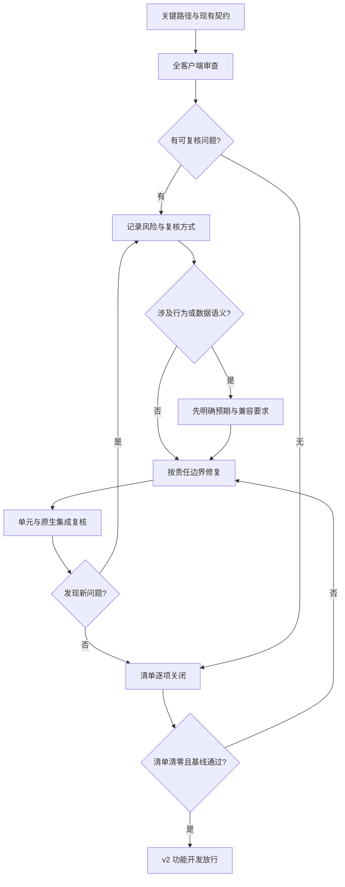

# Windows 客户端代码品质升级 - Plan

## Goal Capsule

- **Objective:** 在 v2.0.0 功能升级前，完成 Windows 客户端的代码品质审查并解决其中确认的全部问题，使现有阅读、书库和任务行为有可复现的保护，后续改动能明确定位责任边界。
- **Product authority:** [STRATEGY.md](../../STRATEGY.md) 和 [CONCEPTS.md](../../CONCEPTS.md) 定义既有产品行为；本计划覆盖客户端代码品质，v2 新功能另行规划。
- **Open blockers:** 无。审查发现可能改变产品行为的问题，先明确预期行为再修复。
- **Means:** 以行为基线和证据化审查形成有限清单，按边界分批修复并复核清零（KTD1、KTD2）。
- **Stop condition:** 发现无法在保持现有产品语义的前提下修复的问题时，先确定行为与兼容要求，不擅自改变产品规则。
- **Execution profile:** 直接在 `steven123397/dev` 分批实施；每批独立验证，提交前核对 `docs/current.md`。

## Product Contract

### Summary

对整个 Windows 客户端做一次有边界、可复核的代码品质审查，建立关键行为基线，并在 v2 功能开发前解决审查确认的全部问题。审查和修复以行为可靠性、边界清晰度、可测试性与维护成本为依据。

### Problem Frame

现有客户端已有 `view.js`、`qa.js`、Rust 协议与 PDF 映射等分层实现，也有 JavaScript 契约测试和 Rust 测试。与此同时，`main.js` 承担多种阅读操作，阅读状态同时存于 `reader` 和局部变量；JS 单测不能覆盖 Tauri 原生桥与窗口行为。v2 计划改动阅读工作台、PDF、出处、问答与更新流程，这些改动会放大现有边界不清或回归保护不足的成本。文件长度本身不构成问题证据。

### Key Decisions

- **覆盖整个 Windows 客户端。** Governs R1. (session-settled: user-directed — chosen over only reviewing the v2 reading path: the user wants the quality upgrade to cover the full client.)
- **确认的问题在 v2 功能开发前全部解决。** Governs R3, R8. (session-settled: user-directed — chosen over fixing only v2 blockers first: the user wants all audit findings addressed before feature work.)

### Requirements

**审查与问题口径**

- R1. 审查覆盖 `app/` 内 Windows 客户端的界面标记与样式、JavaScript、Rust、桥接契约、持久化、任务与资源生命周期、构建打包和验证入口，以及它们之间的边界。
- R2. 每项问题须有可指向代码或可复现行为的证据，说明风险、受影响路径与完成后的判定方式；单纯文件长度或个人风格偏好不算问题。
- R3. 审查清单固定后，所有确认的问题均须在 v2 新功能开发前修复并复核；修复中新发现的确认问题进入同一清单。

**行为与兼容**

- R4. 品质升级保持现有产品行为和本地书库数据可读；需要改变行为或数据契约时，先明确新旧行为与兼容要求。
- R5. 关键路径须有可复现的基线，覆盖导入与书库、建图与深挖、阅读位置与出处、翻译与提问、PDF 浏览、任务取消与失败恢复。
- R6. 对跨 JavaScript、Rust、SQLite、文件及窗口的路径，验证应到达实际发生风险的边界，不能用纯逻辑单测代替原生集成验证。

**完成条件**

- R7. 每批改动应能独立验证所针对的问题已解决，且现有行为没有无意变化。
- R8. 进入 v2 功能开发前，确认的问题清单无未解决项，关键路径基线与适用的自动检查通过，原生集成风险有验证记录。

### Key Flows

- F1. **Trigger:** 开始 v2 前置代码品质工作。**Steps:** 盘点客户端边界和关键路径，建立行为基线，记录有证据的问题并固定清单；修复后逐项复核，新发现的问题并入清单。**Outcome:** 清单完成且达到 R8。
- F2. **Trigger:** 某项修复可能改变用户行为或书库数据。**Steps:** 对照现有行为与产品约束，确认预期及兼容要求，再实施和验证。**Outcome:** R4 得到可复核的保障。

### Acceptance Examples

- AE1. **Covers R2, R3.** 若只发现一个大文件而没有行为风险或具体耦合证据，该观察不计入待修问题；若跨模块状态同步导致位置丢失且能复现，则进入清单并在放行前修复。
- AE2. **Covers R4, R6.** 若单测通过但安装版的书库读取、任务取消或窗口退出失败，该批改动不算验收通过。
- AE3. **Covers R3, R8.** 若修复过程中发现另一项经确认的代码品质问题，该问题加入清单；在它完成并复核前不启动 v2 新功能开发。

### Scope Boundaries

- 本计划不交付新阅读布局、PDF 文字层、问答取证、应用内更新、模型下载或跨端同步功能。
- `skills/` 是产品阅读提示词；仅审查客户端对其加载和运行的代码契约，不将提示词内容改写纳入代码品质工作。
- 第三方 vendored 代码以集成风险和版本边界为审查对象；没有项目侧证据时，不将其内部风格列为问题。

<!-- ce-section: work-relationships -->
### How This Work Fits Together

本计划只处理 v2 的前置代码品质工作。以下是当前理解的后续关系，不是已承诺的开发顺序：

- **Enables:** 阅读工作台、PDF 与出处联动、问答升级可在稳定的客户端边界上实施。
- **Can proceed independently of:** 应用内更新、解析侧车打包形态和跨端数据准备各有独立的产品验收与计划。

### Sources / Research

- [v2.0.0 方向修订](../ideation/2026-09-24-paper30min-v2-revision.md) 提出先建行为基线、审查边界，再开展阅读链路升级；它是建议材料，不是本计划的指令来源。
- [当前进度](../current.md)、[客户端说明](../../app/README.md)、`app/ui/js/main.js`、`app/ui/js/view.js`、`app/tests/view.test.mjs` 与 `.github/workflows/ci.yml` 提供当前实现和验证入口。

## Planning Contract

**Product Contract preservation:** Product Contract unchanged.

### Key Technical Decisions

- KTD1. **先定行为基线，再改内部结构。** 将现有测试、安装版关键路径和持久化兼容样本作为修复对照；原因是纯逻辑测试不能说明窗口、桥接和文件操作正常。落实 R4-R6。
- KTD2. **清单以可复核证据闭环。** 在一次完整的客户端审查后固定首轮清单，记录修复中新增问题，逐项以测试、复现步骤或代码不变量关闭；不会用统一的“重构完成”替代逐项判定。落实 R2、R3、R8；承接 Product Contract 的两项会话决策。
- KTD3. **按现有所有权边界治理。** JavaScript 负责界面与前端状态，Rust 负责书库、文件、模型、网络与协议；优先消除重复状态、隐式跨层依赖和难以验证的副作用，不以拆分文件作为目标。依据 `AGENTS.md`、`app/README.md` 和现有模块结构。落实 R1、R7。

### High-Level Technical Design

以下是审查与修复的方向，不预设每个模块都有缺陷。问题清单是审查产物；具体修复以证据决定。

### Sequencing and Assumptions

U1 和 U2 先建立基线与清单；U3-U5 根据清单中的实际发现实施，可在不冲突的模块上分批推进；U6 复核全量结果。审查覆盖全部客户端，但问题数量与具体修复点在 U2 完成前未知。U2 应把每项确认的问题映射到 U3-U5 或补充新的实施单元，并给出相应测试场景；不得因本计划未预先列名而跳过。

### Risks and Dependencies

- 书库采用 SQLite WAL，涉及迁移、附件和持久化的修复可能损坏历史数据；须用代表性旧书库和一致性备份验证，不能只复制数据库主文件。
- 现有 `node --test` 和 CI 检查未覆盖 Windows 安装版的全部 WebView2、侧车与窗口行为；本机原生烟测和必要的安装版走查是放行证据。
- “全部确认问题先修完”可能扩大工期；以 R2 的证据标准维持范围，新增确认问题如实纳入清单并更新实施安排，不降低 R8 的放行门槛。

## Implementation Units

### U1. 建立关键行为与验证基线

- **Goal:** 为 R4-R6 建立改动前可复现的检查结果和代表性数据样本。
- **Requirements:** R4, R5, R6。
- **Files:** `app/tests/`, `app/src-tauri/src/smoke.rs`, `app/README.md`, `tools/check_syntax.mjs`；如需新夹具，放在现有测试目录。
- **Approach:** 盘点已有测试所覆盖的用户路径和空白；对导入、书库、建图、深挖、阅读位置、出处、翻译、问答、PDF、任务退出选择代表性正常与失败场景。保留旧书库与附件样本的兼容检查。记录当前失败项，不把已存在的失败归咎于后续重构。
- **Test scenarios:** 旧书库打开后论文、产物、译文、问答和阅读位置仍可读；取消生成后任务终态与已有内容一致；无 PDF、无块模型、失败下载时客户端显示现有降级行为。
- **Verification:** 运行 Verification Contract 中的现有检查并记录基线；原生桥与窗口场景另做桌面走查。

### U2. 完成全客户端审查与问题清单

- **Goal:** 对 R1-R3 形成带证据、责任边界和复核方式的有限清单。
- **Requirements:** R1, R2, R3。
- **Files:** `app/ui/`, `app/src-tauri/src/`, `app/tests/`, `app/src-tauri/Cargo.toml`, `app/src-tauri/tauri.conf.json`, `app/package.json`, `tools/`, `.github/workflows/ci.yml`。
- **Approach:** 先画出界面、JS 状态与事件、桥接 DTO、Rust 服务、SQLite 与文件、后台任务及侧车之间的调用关系，再检查重复状态、错误传播、资源释放、界面可用性、测试盲区和构建验证。每个发现记录具体位置或复现、风险、修复方向、预期复核；观察项和审美偏好不计入确认问题。
- **Test scenarios:** 对一项能复现的状态错位写明输入、操作和错误结果；对只有文件过长而无风险证据的观察不建问题；对审查期间新出现的跨层问题补充清单条目。
- **Verification:** 清单覆盖 R1 所列边界，且每项满足 R2；问题映射到 U3-U5 或新增实施单元。

### U3. 修复 JavaScript 状态与界面边界问题

- **Goal:** 关闭 U2 确认的前端状态、渲染与事件生命周期问题。
- **Requirements:** R3, R4, R7。
- **Files:** `app/ui/index.html`, `app/ui/style.css`, `app/ui/js/main.js`, `app/ui/js/view.js`, `app/ui/js/qa.js`, `app/ui/js/present.js`, `app/tests/view.test.mjs`, `app/tests/qa-ui.test.mjs`；其他前端文件按清单确定。
- **Approach:** 针对证实的问题明确状态所有权与更新入口，隔离可独立验证的规则，清理过期监听与异步结果。已有纯逻辑模块和测试可复用；界面行为变更依 R4 单独确认。
- **Test scenarios:** 切章节、切 tab、点出处、打开与关闭 PDF 后位置一致；切换论文时上一论文的异步结果不污染当前界面；取消问答与翻译时显示和持久化结果符合现有语义。
- **Verification:** `node --test`、语法检查及涉及 WebView2 的桌面走查；逐项对照 U2 清单关闭。

### U4. 修复 Rust 存储、任务与协议边界问题

- **Goal:** 关闭 U2 确认的持久化、任务生命周期、模型和 PDF 解析问题。
- **Requirements:** R3, R4, R7。
- **Files:** `app/src-tauri/src/library.rs`, `app/src-tauri/src/tasks.rs`, `app/src-tauri/src/protocol.rs`, `app/src-tauri/src/pdfmap.rs`, `app/src-tauri/src/pdfpool.rs`, `app/src-tauri/src/migration.rs`；其他 Rust 文件按清单确定。
- **Approach:** 依现有 Rust 模块所有权逐项处理确认的问题；涉及数据库或地址语义时保留旧数据可读，涉及任务和侧车时检查取消、失败和资源释放。避免在品质修复中提前实现 v2 功能。
- **Test scenarios:** 旧书库迁移或读取失败不造成静默数据丢失；任务取消、失败重试和窗口退出保持一致终态；解析失败时不留下被标为可用的不完整产物。
- **Verification:** `cargo test`、`npm run smoke`，持久化相关问题使用旧书库样本复核。

### U5. 修复跨层契约与验证链路问题

- **Goal:** 关闭 U2 确认的桥接、文件边界及 CI 覆盖缺口。
- **Requirements:** R3, R6, R7。
- **Files:** `app/src-tauri/src/bridge.rs`, `app/ui/js/store.js`, `app/ui/js/model.js`, `app/tests/bridge.test.mjs`, `.github/workflows/ci.yml`, `app/README.md`；实际改动按清单确定。
- **Approach:** 对照版本化命令和 DTO 检查错误、取消与持久化语义，给跨层问题补相应契约测试或原生检查。CI 只加入能够在其环境稳定复现、与发现问题对应的检查。
- **Test scenarios:** 任务在事件订阅前已结束时仍能收尾；桥接错误保留稳定错误形状；文件与数据库写入失败不让界面显示成功；Windows 原生风险有对应的本机验证记录。
- **Verification:** `node --test`、`cargo test`、`npm run smoke` 与受影响的安装版路径。

### U6. 全量复核并放行 v2 功能开发

- **Goal:** 证明 R8 达成，且审查和修复没有留下未确认的隐性尾项。
- **Requirements:** R3, R5, R7, R8。
- **Files:** U2 问题清单、受影响的 `app/tests/`、`app/src-tauri/src/`、`docs/current.md`。
- **Approach:** 逐项核对问题证据与关闭证据，重跑全量检查和代表性桌面路径，检查残留试验代码、死分支与文档偏差。若出现新确认问题，返回相应实施单元处理。
- **Test scenarios:** 清单中每项均有对应修复和复核证据；任一关键路径回归或新增确认问题使放行失败；无确认问题但无法完成原生走查时记录未验证风险，不能标为通过。
- **Verification:** 完成下列 Verification Contract，核对 `docs/current.md` 与实际进度。

## Verification Contract

| 检查 | 运行位置与命令 | 证明范围 |
| --- | --- | --- |
| JavaScript 单测 | `app/` 下 `node --test` | 前端规则与桥接客户端契约 |
| Rust 单测 | `app/src-tauri/` 下 `cargo test` | 存储、协议、解析与任务逻辑 |
| JavaScript 语法 | 仓库根目录 `node tools/check_syntax.mjs` | 未被测试导入的入口文件 |
| 原生桥烟测 | `app/` 下 `npm run smoke` | Tauri 命令与任务集成 |
| 桌面走查 | Windows 开发版与受影响的安装版 | WebView2、窗口、PDF、侧车及旧书库真实路径 |

上述检查按 U1 记录改动前基线，按每批影响范围运行，U6 再执行全量复核。某项检查因环境缺失无法运行时写明原因和未验证风险，不记为通过。

## Definition of Done

- U1-U6 的交付和各自验证均完成；U2 清单及实施中新确认的问题全部关闭，且每项有可复核证据。
- 关键路径保持 R4 的既有行为，旧书库与附件可读；有意改变的行为已明确约定并验证兼容。
- Verification Contract 的适用检查通过，原生集成与安装版风险已走查；无法运行的检查没有被标为通过。
- 清除废弃试验代码、临时分支逻辑和过时注释；提交前核对并按实际进度更新 `docs/current.md`。
