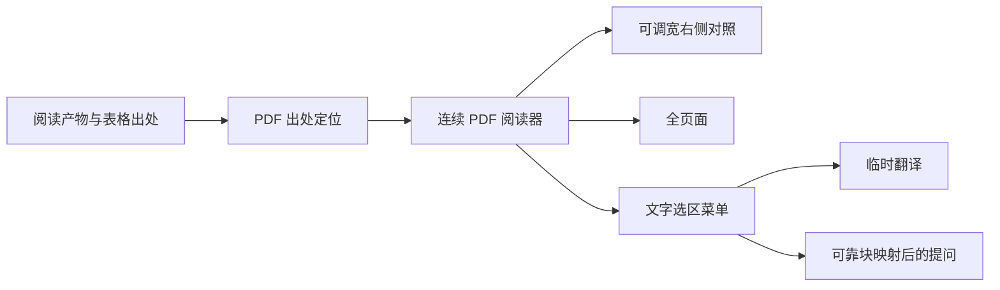
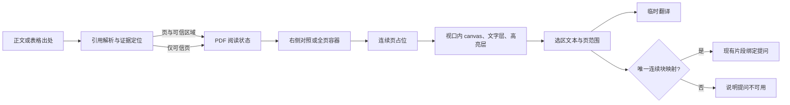
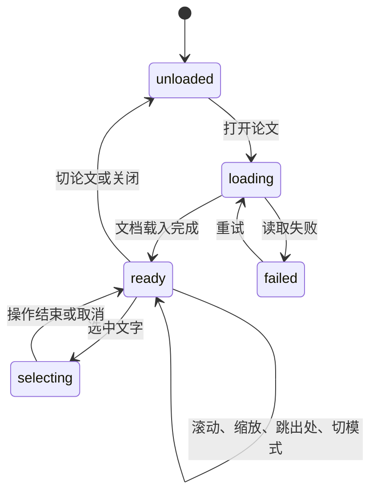

# PDF 证据阅读与选区操作 - Plan

## Goal Capsule

- **Objective:** 读者在 v1.3.0 中能连续阅读 PDF，从阅读产物的出处直达原文证据，并在 PDF 上选择文字进行翻译或有出处约束的提问。
- **Authority:** 本轮用户确定的交互边界、`STRATEGY.md` 的可核验出处原则和现行代码事实依次约束规划；其他 v2.0.0 方向不进入本 Plan。
- **Stop condition:** 若选区提问无法可靠关联原文文本块，或精确高亮会把页级线索冒充为已命中区域，须按需求降级并报告，不能伪造精确出处。

---

## Product Contract

### Summary

把现有单页 PDF 对照栏升级为连续阅读器。它既能在可调宽的右侧对照栏使用，也能切换到全页面；产物中的出处可打开 PDF 并尽可能高亮证据。PDF 文字选区提供就地翻译和受原文块地址约束的提问。

需求补充（2026-09-30）：用户要求安排按住鼠标拖动 PDF 位置，新增 R11，由 U4 实施、U5 验收。选择文字与抓手分为两种工具是本次规划采用的交互方案。

### Problem Frame

当前图表出处会转到节页资源，块出处会转到提取后的原文，读者仍需自行在 PDF 中查找真实位置。单页 canvas 重绘会丢失局部滚动位置，PDF 内不能选字，阅读证据与后续操作割裂。

### Key Decisions

- **连续多页阅读。** (session-settled: user-directed — chosen over single-page viewing: 读者希望像普通 PDF 阅读器一样滚动阅读；Governs R1, R2)
- **同一 PDF 支持右侧对照与全页面。** (session-settled: user-directed — chosen over one fixed surface: 对照和专注阅读都需要，且右侧宽度必须可调；Governs R2, R3)
- **出处优先定位 PDF 原文，精度不足则显式降级。** (session-settled: user-directed — chosen over blocking navigation or forced reparsing: 旧论文也应能回到证据所在页；Governs R4, R5)
- **选区菜单仅有翻译与提问。** (session-settled: user-directed — chosen over editing PDF text: 截图只展示选后操作形态；Governs R6, R7)
- **翻译可跨页且不写入整节译文，提问必须匹配原文块。** (session-settled: user-directed — chosen over page-only selection questions: 读者接受翻译即时性，同时要求提问出处可靠；Governs R7, R8)

### Requirements

**PDF 阅读**

- R1. PDF 按页纵向连续滚动，读者可滚动、输入页码、适配宽度、放大和缩小；大论文也应保持可交互，不必一次渲染全部页面。
- R2. 同一阅读器可在可调宽的右侧对照栏与全页面视图之间切换；切换时保持当前论文、可见页和局部阅读位置。
- R3. 缩放应围绕指针或当前可见内容附近保持位置，不跳回页首；Ctrl+滚轮及触控板缩放须在目标 Windows WebView2 环境中表现明确，其他滚动仍用于连续阅读。
- R11. 右侧对照与全页面均提供抓手工具；选中后按住鼠标左键即可横向或纵向拖动 PDF，移动受滚动范围约束，无需等待长按延时。提供“选择文字 / 抓手”工具切换，选择文字模式保留 R6 的拖选行为；扫描 PDF 也可使用抓手。

**出处联动**

- R4. 阅读地图、节薄摘要、深挖、问答等阅读产物中出现的页、文本块、图、表出处，无论位于正文还是 Markdown 表格单元格，点击后都打开 PDF 并定位到对应页面或区域，保留原产物的阅读上下文。
- R5. 只有图表页内区域或文本匹配足以确认目标时才显示对应区域的 PDF 高亮；无法确认时仍跳到可信页，显示“仅页级定位”，不标出猜测的区域。

**PDF 选区**

- R6. 可选中文字的 PDF 允许在连续阅读器中选择单页或跨页片段，选区旁出现“翻译”和“提问”操作；选中文字保持可见，操作针对用户实际选中的内容。
- R7. 选区翻译对单页及跨页片段可用，结果在选区附近临时显示；失败可重试，结果不覆盖或自动追加到已保存的整节译文。
- R8. 选区提问仅在选中的片段可可靠映射到书库中的原文文本块时可发起，并沿用现有绑定提问语义；映射失败时明确说明原因，仍保留翻译操作。
- R9. 扫描版或无可选择文字层的 PDF 仍可阅读和接受页级出处定位；界面明确说明无法直接选字操作，不制造虚假的选区。

**兼容与边界**

- R10. 已有论文、块模型、阅读产物和书库位置记录保持可读；旧论文不因缺少精确坐标而被强制重新解析，已有页码可用于恢复阅读。

### Key Flows

- F1. 读者从产物正文或表格点出处，PDF 在当前阅读上下文中展开并滚到目标；若目标区域可信则高亮，否则停在目标页并给出页级提示。（R4-R5）
- F2. 读者在右侧连续阅读、调宽或切到全页面，滚动、缩放或使用抓手拖动后可继续读刚才的区域；输入页码可跳到指定页。（R1-R3、R11）
- F3. 读者在 PDF 选中跨页文字，在选区附近选择翻译并查看临时结果；若块映射可靠，也可选择提问。（R6-R8）

### Acceptance Examples

- AE1. 已有论文的 `(tbl_2)` 有可信页内区域时，点产物表格单元格里的该出处会展开 PDF、滚到表格并高亮表格区域；原表格仍可返回阅读。
- AE2. 点文本块出处时，如 PDF 文字与该块能唯一可靠匹配，阅读器高亮对应文字；旧块只有页码或匹配歧义时只跳页并显示“仅页级定位”。
- AE3. 点 `(p5)` 时显示第 5 页，页号本身不产生假定的文本高亮。
- AE4. 在右侧对照栏放大第 8 页中段并切到全页面后，仍能继续查看该区域；返回对照栏不回到文档开头。
- AE5. 在相邻两页选择文字后可翻译并查看临时结果，既有整节译文不变；选区未能对应连续、可信的原文块时，“提问”不可发起并说明原因。
- AE6. 扫描页没有可选择文字时，翻译与提问选区操作不可用，但 PDF 浏览和页级出处跳转正常。
- AE7. 放大 PDF 后切换抓手，按住左键可横纵拖动，页码随可见页更新；越过窗口边缘松手、取消或窗口失焦后停止拖动并恢复非拖动光标。切回选择文字后仍可跨页选字；扫描页也可拖动。

### Scope Boundaries

- 本 Plan 不重排地图、原文、译文、深挖与问答的整体信息架构，也不把 PDF 改成唯一阅读表面。
- 不提供 PDF 原文编辑、整节译文自动改写、扫描 OCR 新后端或通用问答取证工具。
- [更新停流 #97](https://github.com/attackingjensen/paper-30min/issues/97)属于同一 v1.3.0 版本的独立可靠性交付，不属于本 Plan 的 PDF 验收。

<!-- nk-section: work-relationships -->
### How This Work Fits Together

本 Plan 只定义 PDF 证据阅读。#97 可独立实施和验证；两者共享 v1.3.0 版本分支与最终版本验收。PDF 改动须复核异步状态、渲染生命周期与桌面行为；已交付的 v1.2.0 代码品质计划不再作为前置任务。

### Sources / Research

- [方向修订](../ideation/2026-09-24-paper30min-v2-revision.md)、[产品边界](../../STRATEGY.md)、[领域术语](../../CONCEPTS.md)。
- [PDF 阅读器与出处点击](../../app/ui/js/main.js)、[出处路由](../../app/ui/js/view.js)、[出处语法](../../app/ui/js/protocol.js)、[块与图表位置](../../app/src-tauri/src/pdfmap.rs)。
- [Windows 桌面与测试入口](../../app/README.md)、[v1.2.0 验证边界](../releases/v1.2.0.md)。

---

## Planning Contract

### Key Technical Decisions

- KTD1. 以同一 PDF 文档和阅读坐标驱动右侧与全页两种容器；模式切换记录当前可见页及页内相对锚点，再在目标容器恢复。依据现有 `reader` 与 `pdfPage` 分离的状态事实，落实 R1-R3、R10。
- KTD2. 页占位保留连续文档高度，canvas 按视口及邻近页加载、离屏释放；文字层与高亮层使用同一 PDF.js viewport 坐标。选区进行中保留已选及相邻页文字层，保证跨页拖选不会因回收断裂。落实 R1、R5-R7。
- KTD3. 出处先解析为页和可选区域；图表采用已有页内矩形并与 PDF 页面尺寸核对，普通文本通过 PDF 文字层与块文本的页内唯一匹配取得区域。缺页或匹配不唯一时按 R5 降级，不能根据块的首页纵向位置伪造文字高亮。落实 R4-R5、R10。
- KTD4. PDF 选区仅从实际文字层取文本与页范围；提问映射还须验证选区文字在块模型中的连续且唯一对应关系，沿用现有 `fragmentBinding`。翻译只取选中文字并走现有模型阶段，不写 `papers.setTranslation`。落实 R6-R9。
- KTD5. 页码输入和出处跳转改变文档锚点；普通滚动只更新当前页，不触发重新定位。缩放先记录指针下的页内坐标，布局完成后恢复该点；无指针时用视口中心。落实 R1-R3。
- KTD6. 抓手复用阅读器滚动容器，以 Pointer Events 和 pointer capture 跟踪左键拖动，按指针位移的反方向更新 `scrollLeft` / `scrollTop`，沿用当前页跟踪与滚动边界。仅从 PDF 内容区域开始，排除工具栏、按钮和浮层；抓手模式抑制原生选字，选择文字模式保留原生选区行为。工具用可键盘操作的图标切换控件表达，并提供名称、提示和选中状态；空闲为 grab、拖动为 grabbing。pointerup、pointercancel、lostpointercapture、窗口失焦、工具或模式切换、切论文及关闭均结束拖动并释放捕获；缩放或重排时也结束当前拖动，避免沿用失效坐标。工具状态仅保留在会话，不新增 Rust DTO。落实 R6、R9、R11。

### High-Level Technical Design

### Sequencing, Risks and Deferred Decisions

U1 建立连续阅读状态与可见页调度；U2 完成双模式和缩放位置；U3 接入出处；U4 才加入文字选区、操作和抓手平移；U5 做真实窗口集成。大论文页数、双栏文本和 PDF.js 当前打包版本的文字层细节需在 U1/U4 用夹具核实，不以未验证的 API 形状写死方案。旧论文只保留页号的持久化记录可继续读取；页内锚点是否持久化及数据版本调整由 U2 根据现有 DTO 契约决定，不能让旧记录失效。

---

## Implementation Units

### U1. 连续页阅读底座

- **Goal:** 建立按需渲染的连续 PDF 页面与稳定当前页。
- **Requirements:** R1, R9, R10；F2；AE3、AE6。
- **Files:** `app/ui/js/main.js`, `app/ui/index.html`, `app/ui/style.css`, `app/tests/view.test.mjs`；必要时新增 `app/ui/js/pdf-reader.js` 与 `app/tests/pdf-reader.test.mjs`。
- **Approach:** 按 KTD2 维护页尺寸占位和邻近页调度，保留现有加载请求门禁与过期渲染取消；滚动位置推导当前页，输入页码按 KTD5 跳转。PDF 缺失、读取失败和扫描页的浏览路径保持可用。
- **Test scenarios:** 多页滚动更新页码且不重建文档；快速切论文后旧页不覆盖新论文；大页数文档只保留有限 canvas；扫描页可浏览但没有可选文本。
- **Verification:** 连续页可浏览，快速切换无旧画布，离屏页释放后回滚可重绘。

### U2. 双模式与阅读锚点

- **Goal:** 右侧可调宽对照和全页阅读共享同一阅读位置。
- **Requirements:** R2, R3, R10；F2；AE4。
- **Dependencies:** U1。
- **Files:** `app/ui/js/main.js`, `app/ui/js/view.js`, `app/ui/js/pdf-reader.js`, `app/ui/index.html`, `app/ui/style.css`, `app/tests/view.test.mjs`, `app/tests/pdf-reader.test.mjs`。沿用 U1 的阅读器模块承接锚点计算与回归测试。
- **Approach:** 按 KTD1、KTD5 统一模式、缩放和页内锚点；保留当前可调宽控制，按既有位置 DTO 兼容旧页码。处理容器宽度变化和窗口 resize 的重排。U2 的页内锚点与模式保留在会话中，持久化继续使用既有页码 DTO；模式切换和拖宽保留当前缩放，适配宽度由现有按钮明确触发。
- **Test scenarios:** Covers AE4. 页中段切全页再切回保持目标内容；Ctrl+滚轮缩放保持指针附近内容；普通滚轮连续翻页；旧页码记录打开后落在可信页。
- **Verification:** 模式、缩放、拖宽均不回到文档开头，页码与实际可见页一致。

### U3. 产物出处进入 PDF

- **Goal:** 正文和表格中的出处统一落到 PDF 可信位置。
- **Requirements:** R4, R5, R10；F1；AE1-AE3。
- **Dependencies:** U1, U2。
- **Files:** `app/ui/js/view.js`, `app/ui/js/main.js`, `app/ui/js/protocol.js`, `app/ui/js/content.js`, `app/tests/view.test.mjs`；必要时新增定位规则的纯逻辑文件与对应测试。
- **Approach:** 按 KTD3 使用已有页码、图表矩形和可验证的文字匹配；引用路由保留产物上下文，并在侧栏或全页定位。精度不足时显示“仅页级定位”，不画猜测区域。
- **Test scenarios:** Covers AE1-AE3. 表格单元格图表出处高亮可信矩形；普通文本唯一匹配才高亮；旧块歧义和单页引用只跳页；无 PDF 附件给出明确反馈。
- **Verification:** 每个高亮能追溯可信坐标；页级路径无误导性区域高亮。

### U4. 跨页选区、翻译、提问与抓手平移

- **Goal:** 在 PDF 文字层上提供两项就地选区操作，并允许用抓手拖动阅读位置。
- **Requirements:** R6-R9、R11；F2、F3；AE5-AE7。
- **Dependencies:** U1-U3。
- **Files:** `app/ui/js/main.js`, `app/ui/js/pdf-reader.js`, `app/ui/js/view.js`, `app/ui/index.html`, `app/ui/style.css`, `app/ui/js/translation.js`, `app/ui/js/qa.js`, `app/tests/pdf-reader.test.mjs`, `app/tests/view.test.mjs`；必要时新增选区映射模块与 `app/tests/pdf-selection.test.mjs`。
- **Approach:** 按 KTD2、KTD4 保持跨页选择期间的文字层，选区旁提供翻译和提问；提问复用块绑定与现有问答入口。选区变化、切论文、模式切换或关闭时清除临时浮层与过期结果。按 KTD6 提供选择文字与抓手切换，处理拖动捕获和所有结束路径。
- **Test scenarios:** Covers AE5-AE7. 跨页选择返回完整文本并展示临时译文；现有整节译文不变；唯一连续块映射可提问，歧义、缺块或跨无关块不可提问但仍可翻译；请求失败可重试，扫描页无菜单。两种视图的抓手横纵拖动、首尾与横向边界、窗口外松手、取消、失焦和切换均不会残留拖动；缩放或重排中止当前拖动；扫描页可平移，页码随滚动更新，切回选字可跨页选择，工具栏与浮层不触发平移。
- **Verification:** 两项操作只针对实际选区；失败和取消不污染论文或已有译文。抓手与选字互不冲突，拖动结束后光标与滚动状态恢复正常。

### U5. Windows 阅读路径验收

- **Goal:** 在目标 WebView2 中复核所有 PDF 交互和兼容路径。
- **Requirements:** R1-R11；F1-F3；AE1-AE7。
- **Dependencies:** U2-U4。
- **Files:** `app/tests/`, `app/src-tauri/tests/` 中受影响的契约测试，以及 `docs/current.md`；真实窗口走查结果按交付记录归档。
- **Approach:** 使用真实双栏、长论文、旧书库和扫描页验证选区、定位、缩放、抓手平移、两种模式、错误恢复及资源占用；修复发现的范围内问题。
- **Test scenarios:** Covers AE1-AE7. 实际窗口中从产物表格点出处，切模式再返回；触控板与 Ctrl+滚轮均按预期缩放或滚动；物理鼠标在两种视图中横纵拖动，窗口外松手及取消后不残留拖动，切回选字可跨页选择；长论文滚动后页面可继续交互；旧书库与扫描 PDF 均可读且可使用抓手。
- **Verification:** 记录设备、应用构建与实际结果；未运行的安装版路径不标为通过。

---

## Verification Contract

| 检查 | 命令或方式 | 证明范围 |
| --- | --- | --- |
| JavaScript 单测 | `app/` 下 `node --test` | 引用路由、页调度、锚点、选区映射与抓手生命周期 |
| JavaScript 语法 | 根目录 `node tools/check_syntax.mjs` | 未由测试导入的 UI 代码 |
| Rust 测试 | 涉及 DTO、块地址或书库时在 `app/src-tauri/` 下运行 `cargo test` | 旧数据与解析契约 |
| 原生桥 | 涉及桥接时在 `app/` 下运行 `npm run smoke` | Tauri 集成 |
| 桌面走查 | Windows WebView2 开发版及受影响的安装版 | 连续渲染、真实选择、滚轮、触控板、鼠标抓手拖动、双模式与旧书库 |

## Definition of Done

- U1-U5 对应的 R/F/AE 均有执行和验证证据；PDF 出处精度与失败降级符合 R5。
- 旧书库与扫描页可阅读，整节译文和已有问答不因 PDF 选区操作改变。
- 两种视图均可用抓手横纵平移，正常结束与取消不残留拖动，切回选择文字后可继续跨页选字。
- 适用的自动检查与真实窗口路径完成并记录结果；GitHub CI 不可用期间不声称 CI 通过。
- 删除废弃的单页渲染分支、临时试验代码和过期提示；`docs/current.md` 与实际交付一致。
