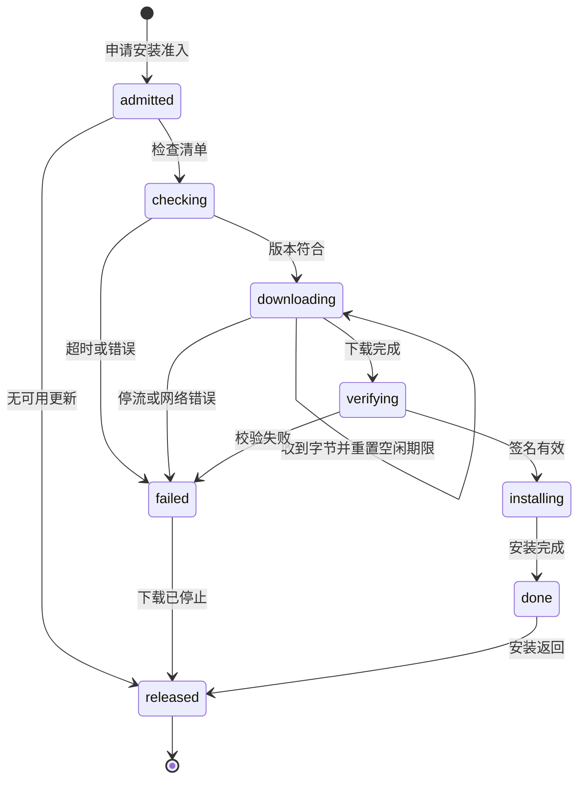

# 更新检查与下载停流恢复 - Plan

## Goal Capsule

- **Objective:** 更新端点或安装包下载停流后，应用能结束本次更新并恢复任务与组件操作；正常慢速下载仍可完成。
- **Authority:** [Issue #97](https://github.com/attackingjensen/paper-30min/issues/97)、现有更新准入契约和 v1.2.0 已交付行为约束本 Plan。
- **Stop condition:** 若插件下载与安装无法分离，或取消下载可能在后台继续安装，不得通过单纯超时包裹 `download_and_install()` 冒充安全恢复。

---

## Product Contract

### Summary

为更新检查设有界等待，并对安装包下载建立随实际数据进展重置的读空闲期限。失败或停流后释放准入，保留现有签名验证和安装行为。

### Problem Frame

当前 `updater::install` 在占用准入门后等待无期限的检查和下载。端点停流时其他任务和组件操作持续被拒，只有重启才能恢复；插件的整请求期限也会误伤持续有进展的大文件下载。

### Requirements

- R1. “检查更新”入口和安装前的二次检查都在有界等待内完成；超时后显示可重试错误，不继续下载或安装。
- R2. 下载仅在连续无数据进展超过空闲期限后失败；持续收到数据的慢速下载不因累计时间长而失败。
- R3. 检查失败、下载停流或网络错误后，本次下载停止，安装不开始，更新准入释放，新任务与组件操作可以再次进入。
- R4. 下载完成后仍按原有更新器签名与版本校验进入安装；安装期间维持准入，不能把安装耗时当作下载停流。
- R5. 已有进度事件、错误提示、更新版本二次确认及重试入口保持可用；停流提示可区分检查与下载阶段。

### Key Flows

- F1. 用户检查更新或确认安装，检查端点停流；等待到期后看到可重试错误，任务准入恢复。（R1、R3、R5）
- F2. 安装包持续慢速传输，进度继续变化且下载完成，随后签名校验与安装照常进行。（R2、R4）
- F3. 下载中断流或发生网络错误；当前更新结束，不触发安装，随后可以重试或运行其他任务。（R3、R5）

### Acceptance Examples

- AE1. 模拟安装前二次检查不返回，期限到后安装退出；立即启动生成任务不再得到“正在安装更新”的拒绝。
- AE2. 模拟每次在空闲期限内送达一小块但总下载超过该期限，下载完成并进入签名安装。
- AE3. 模拟最后一块后永久停流，空闲期限到后下载停止、无安装动作，组件操作恢复。

### Scope Boundaries

- 不重新开发更新器、发布清单、安装包签名或组件下载器；#94 的组件超时属于已交付工作。
- 不为安装阶段施加与下载相同的超时，避免在 Windows 安装已启动后错误释放准入。
- 真实签名更新和安装路径矩阵仍按[正式版说明](../releases/v1.2.0.md)单独验收，不能由本 Plan 的模拟停流测试替代。

<!-- nk-section: work-relationships -->
### How This Work Fits Together

本 Plan 承接 #97，与[PDF 证据阅读](2026-09-29-2254-feat-pdf-evidence-reading-plan.md)可独立实施，最终同属 v1.3.0 版本验收。

### Sources / Research

- [Issue #97](https://github.com/attackingjensen/paper-30min/issues/97)、`app/src-tauri/src/updater.rs`、`app/src-tauri/src/admission.rs`、`app/ui/js/updater.js`、`app/tests/updater.test.mjs`。
- `app/src-tauri/Cargo.lock` 钉版的 `tauri-plugin-updater` 2.12.0 与现有组件下载停流处理路径。

---

## Planning Contract

### Key Technical Decisions

- KTD1. 两处 `updater.check()` 使用短的完整等待期限；检查只传输小型清单，期限到即取消等待并返回阶段化错误。落实 R1、R3。
- KTD2. 下载与安装分阶段：下载期以收到字节为活动信号重置读空闲计时，完成且验证后才调用插件安装；不在 `download_and_install()` 外包一个总时长超时。落实 R2-R4。
- KTD3. 超时和错误必须结束下载 future 后才让 InstallClaim 离开作用域；复用现有准入门与进度事件，不另建更新状态机。落实 R3-R5。

### High-Level Technical Design

检查和下载的计时独立；插件分阶段 API 的确切参数和取消保证在 U1 核实。如现有插件 API 无法保证取消即停止下载，U1 先找可验证的受控下载方案，不能假设丢弃 future 就足够。

### Sequencing and Risk

U1 核实插件 API 与准入生命周期并固定可测试边界；U2 实施两类期限及错误恢复；U3 做原生和真实更新路径回归。默认期限应参照现有组件下载配置和用户可等待行为，作为明确常量并由停流测试覆盖；不以任意大文件总时长作期限。CI 当前不可用，原生和窗口结果须本机记录。

---

## Implementation Units

### U1. 核实下载与安装分离边界

- **Goal:** 找到能停止下载且保留插件验签安装的实际 API 路径。
- **Requirements:** R2-R4；AE2、AE3。
- **Files:** `app/src-tauri/src/updater.rs`, `app/src-tauri/src/admission.rs`；必要时在 `app/src-tauri/tests/` 加入受控下载夹具。
- **Approach:** 检查钉版插件的 download/install 能力及中止语义，把进度与准入边界封装为可测试的最小阶段接口；不改变现有签名来源和目标版本二次检查。
- **Test scenarios:** 下载 future 中止后无安装回调；下载完成可进入原插件验签安装；下载错误后准入可再次取得。
- **Verification:** 有源码/API 与测试证据说明中止下载不会留下后台安装；不成立则按 Stop condition 报告并修订方案。

### U2. 检查期限与下载读空闲期限

- **Goal:** 停流后有界失败，同时允许有进展的慢速下载。
- **Requirements:** R1-R3、R5；F1-F3；AE1-AE3。
- **Dependencies:** U1。
- **Files:** `app/src-tauri/src/updater.rs`, `app/ui/js/updater.js`；必要时在 `app/src-tauri/tests/` 增加更新流程测试。
- **Approach:** 按 KTD1-KTD3 将检查和下载阶段分别计时，进度收到实际字节时重置空闲期限；超时和错误走统一清理，保留重试语义。
- **Test scenarios:** Covers AE1-AE3. 检查永不返回、下载停流、持续慢速分块与网络错误分别验证错误阶段、是否安装及准入恢复；零字节通知不能无限延长空闲期限。
- **Verification:** 所有失败路径可重新申请准入，慢速分块成功后才安装，进度事件与错误提示一致。

### U3. 原生与安装版回归

- **Goal:** 证明 #97 修复没有破坏签名更新和任务互斥。
- **Requirements:** R1-R5；F1-F3。
- **Dependencies:** U2。
- **Files:** `app/src-tauri/src/updater.rs`, `app/tests/updater.test.mjs`, `docs/current.md`；必要的测试夹具归入 `app/src-tauri/tests/`。
- **Approach:** 运行受影响的 Rust、前端与原生桥检查，使用受控停流端点验证真实 WebView2 错误与重试；安装版签名更新只在具备测试包和安全环境时标记通过。
- **Test scenarios:** 更新正在下载时任务与组件操作被拒；停流结束后同操作可进入；签名错误不进入安装；已验证测试更新包可正常安装。
- **Verification:** 测试输出及桌面记录可分别证明超时恢复与真实安装，未执行的安装版路径明确留作缺口。

---

## Verification Contract

| 检查 | 命令或方式 | 证明范围 |
| --- | --- | --- |
| Rust | `app/src-tauri/` 下 `cargo test` | 期限、中止、准入和签名路径 |
| JavaScript | `app/` 下 `node --test` | 进度与错误 UI 契约 |
| 语法 | 根目录 `node tools/check_syntax.mjs` | 前端入口语法 |
| 原生桥 | `app/` 下 `npm run smoke` | 更新命令及任务互斥 |
| 桌面与安装 | Windows WebView2、受控停流端点及测试签名包 | 真实停流、重试和安装行为 |

## Definition of Done

- U1-U3 有对应测试与实际边界证据，AE1-AE3 可复现；#97 的失败路径不再要求重启应用释放准入。
- 正常慢速下载和签名安装仍可完成，未执行的安装版路径不标为通过。
- 删除试验下载实现和过时错误提示，`docs/current.md` 记录实际交付结果。

## 实施记录（2026-09-30）

用户授权将 U1-U3 合并为一次交付，完成后统一审查并提交。

### U1：下载与安装边界已核实

锁定的 `tauri-plugin-updater` 2.12.0 中，`Update::download()` 直接持有请求和响应字节流，完成后执行签名及已签版本校验，再返回字节；该函数不派生下载或安装任务。`Update::install()` 单独启动原有安装路径，`download_and_install()` 仅顺序调用这两者。应用改用分阶段接口，超时辅助函数拥有下载 future，返回前先丢弃它，随后才结束持有 `InstallClaim` 的作用域。

Rust 夹具实际调用插件检查、下载和验证：响应头 / 正文停流时，服务器观察到客户端连接关闭；失败后安装回调未调用，任务与组件可重新取得准入。测试字节采用独立测试公钥，正确签名可进入安装回调，篡改字节及签名版本不匹配均被插件拒绝；不执行测试字节或真实安装器。

### U2：检查与下载期限已实现

两处检查共享 20 秒完整等待期限。下载使用 30 秒空闲期限，参照现有组件的 20 秒连接 / 30 秒读取配置；计时从下载开始，覆盖响应头等待，每次非零数据块重置活动时间，零字节通知不延长等待。持续慢速分块可以超过空闲期限累计时长后正常完成。插件返回已验证字节后才发出 `finished` 事件，安装期间不施加该期限并保持准入。

检查、下载停流、下载 / 校验失败和安装失败分别保留阶段化可重试错误。前端增加安装前检查状态，保留失败后的目标版本和重试入口。原生验收发现插件的 `window.confirm` 替换实现为异步函数且调用不存在的 `dialog.confirm` 命令；更新入口局部改为等待既有 `dialog.message` 的 `OkCancel` 结果，取消不触发更新或任务取消，不更改权限及其他确认入口。

### U3：回归证据与边界

- `cargo test --offline` 完整 suite 已通过；随后补充签名版本不匹配和安装回调错误场景，`cargo test --offline --lib updater::tests` 最终 12 项通过。
- `app/` 下 `node --test` 最终 284 项通过；更新状态和确认桥接均有 Red → Green 证据。
- 根目录 `node tools/check_syntax.mjs`：136 文件通过；`app/` 下 `npm run smoke`：14 项通过。
- `npm run test:updater-webview` 最终 9 项通过，报告为 `tmp/updater-webview-1790779761445/report.json`，页面异常为空；真实 WebView2 / Rust / 插件 / 任务准入使用本机停流端点，确认对话框仅替换 IPC 响应。两处检查分别在 20.178 / 20.489 秒恢复，正文 / 响应头停流分别在 30.539 / 30.447 秒恢复，服务器观察到连接关闭；重试被真实签名验证拒绝，未启动安装器。

真实签名安装包的安装、重启、路径和旧书库保留，以及原生确认窗口显示与点击仍未验证。窗口夹具仅证明原生更新和恢复链路；430 px 为 CDP 模拟视口，不能外推所有原生尺寸 / DPI。CI 因账户问题未运行。适用审查及最终窗口报告见 [v1.3.0 审查记录](../reviews/v1.3.0.md)。
